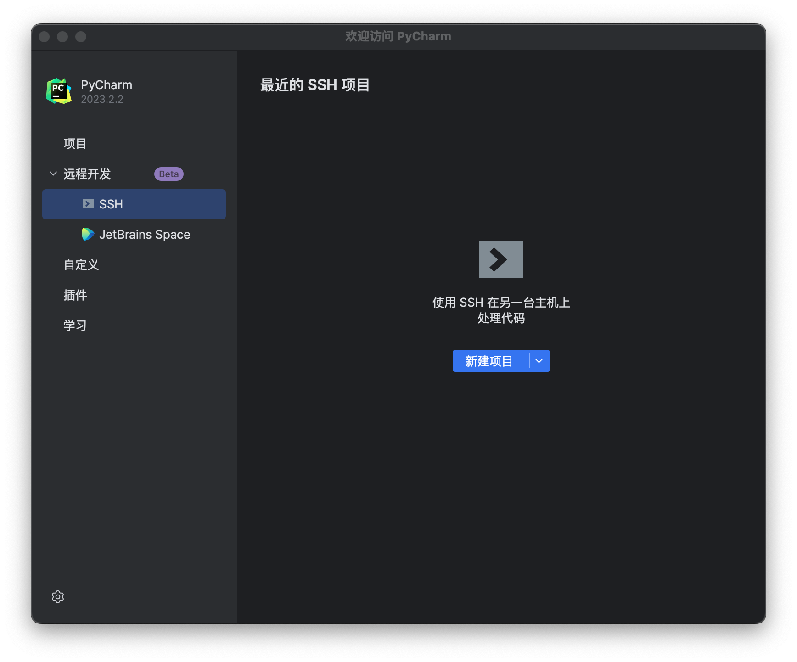
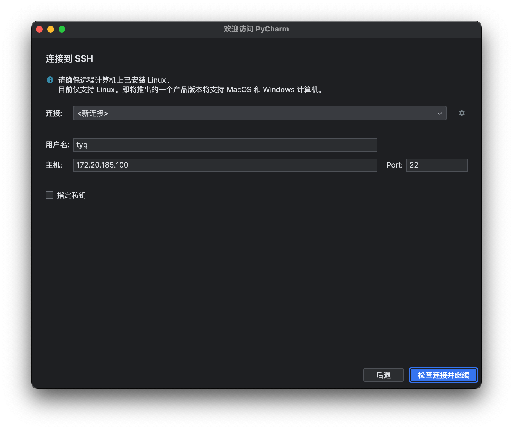
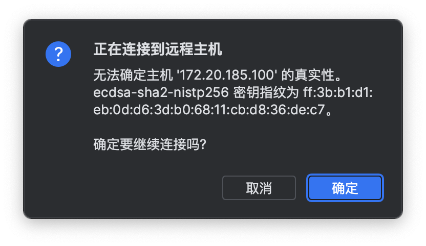
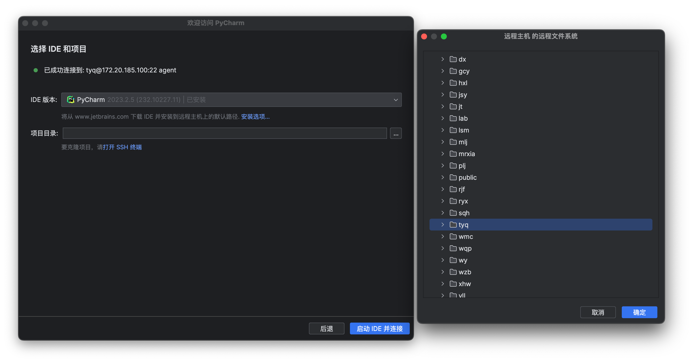
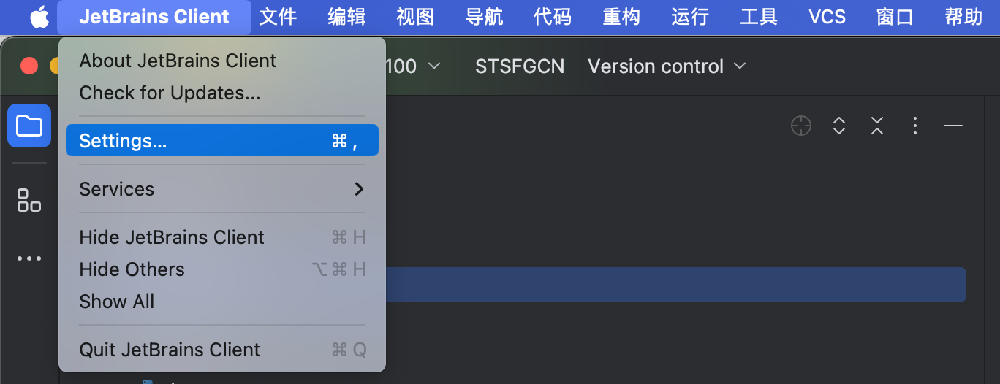
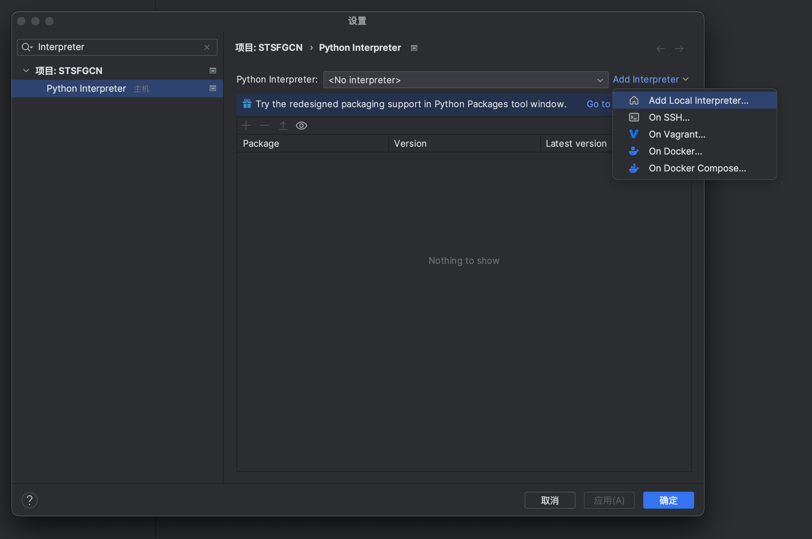
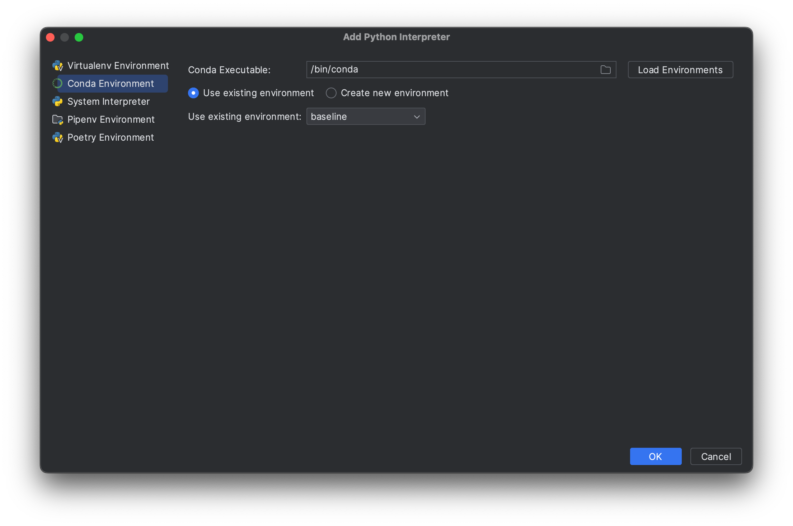

使用PyCharm远程开发
=================
.. warning::
    你使用的PyCharm版本必须是专业版，社区版没有远程开发功能。可以使用以下激活码暂时激活至2024年5月：https://pastebin.com/DE2vqCuF，可以在官网通过学生认证免费激活。

1. 欢迎界面选择远程开发->SSH->新建项目（或菜单栏文件->远程开发）：

2. 选择新连接，输入用户名（名字首字母），主机填写172.20.185.100，端口22（内网）或47.100.130.127，端口12070（外网），选择检查连接并继续，然后输入密码，勾选永久保存，然后选择身份验证：

3. 若出现询问：确定要继续连接吗？，请选择确定。若没有出现，那么直接进行下一步操作：

4. IDE版本选择PyCharm的非EAP版本，项目目录选择你的项目，通常为 ``/home/你的名字/项目名称`` ，项目提前上传至服务器，然后选择确定->启动IDE并连接->输入密码并选择永久连接确认：

5. 配置解释器：进入PyCharm设置，在设置中搜索Interpreter，然后选择添加解释器->添加本地解释器：

6. 按个人情况配置解释器。若配置Conda环境的Python解释器，选择Conda Environment，然后在Conda Executable中填写 ``/bin/conda``，然后点击加载环境（Load Environments）。并在下面的加载项中进行你的环境配置。

.. hint::
    一般情况下，推荐你在终端中进行Conda环境的创建和配置，并在Pycharm中进行加载。这样的方式对于VSCode和Jupyter也是适用的。可以在\ **常见问题-Conda环境搭建**\ 中获得进一步了解。