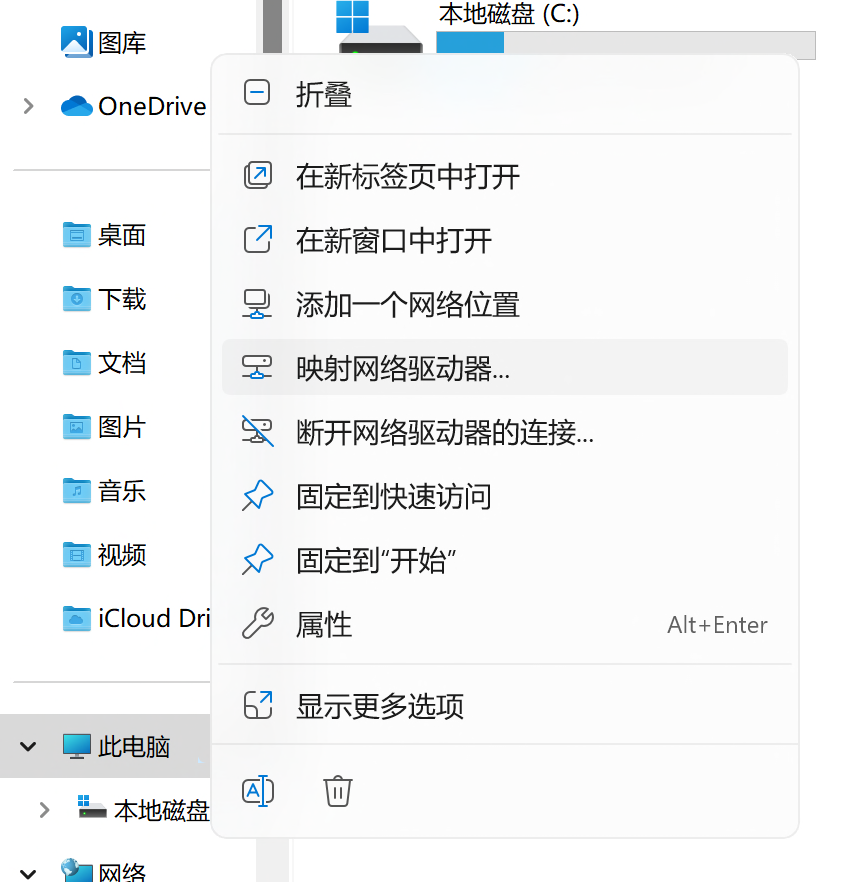
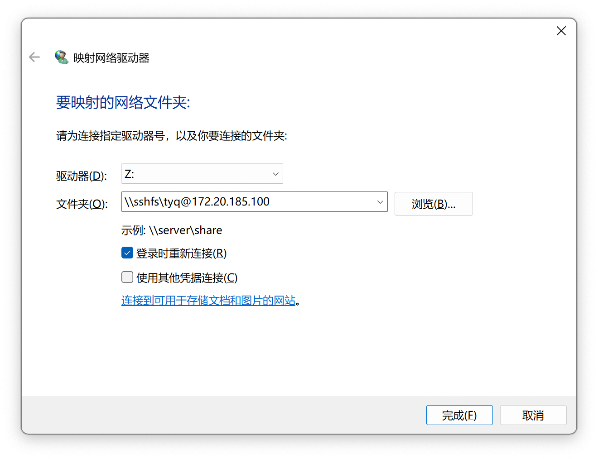
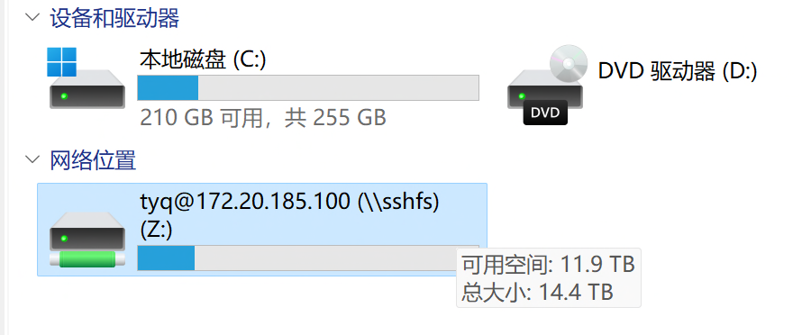

首次使用指南
==========
本指南假设你先前没有任何基于Linux的服务器使用经验。按照本指南一步步操作就可以轻松学会实验室服务器的基本使用方法。

.. note::
    本指南均以4090服务器为例。事实上，针对不同的服务器，只需要改变IP地址即可。

.. warning::
    若是1203的同学，内网IP地址有所不同。需要通过跳板机172.20.185.99连接。端口号12070对应3090服务器，12071对应4090服务器。

服务器连接
---------
通过命令行连接
~~~~~~~~~~~~~
使用任意系统自带终端，例如Windows的命令提示符工具，输入以下命令连接服务器::

    >>> ssh name@172.20.185.100

若是1203的同学，请输入以下命令在内网连接服务器::

    >>> ssh name@172.20.185.99 -p 12070

若不在实验室，请输入以下命令通过公网连接服务器::

    >>> ssh name@47.100.130.127 -p 12070

其中， ``name`` 为自己的姓名缩写，在接下来输入密码时，终端界面不会出现任何提示，这是正常现象。输入完密码直接回车即可，初始密码为 ``12071207`` ，初次连接服务器后，请立即修改初始密码，输入::
    
    >>> passwd

然后按提示修改个人密码。

.. note::

    所有服务器共享账号信息和用户目录。因此，只需在任意服务器修改密码即可在服务器间同步。

通过远程桌面连接
~~~~~~~~~~~~~~~
一般情况下，终端可以完成全部的操作。若感觉终端使用不便，也可以使用Windows系统自带的远程桌面连接软件（Mac对应Microsoft Remote Desktop软件）通过图形界面操作服务器。

1. 在开始菜单查找远程桌面连接，输入服务器地址，并点击高级选项，在用户名处输入服务器用户名，点击连接，如下图所示：

2. 勾选\ **不再询问我是否连接到此计算机**\ ,并选择是：

3. 输入服务器密码，可勾选记住凭据，下次就不需要输入密码了：

4. 进入图形界面后会弹出一个授权，选择Cancel即可：

这样一来，你就可以通过图形界面使用服务器。

.. attention::
    
    不建议直接通过图形界面在服务器上进行代码开发，远程桌面连接仅适合进行一些简单配置以及文件下载。若要编写代码，请通过\ **远程开发**\ 方式使用服务器。
    1203的同学请通过\ ``172.20.185.99:12072``\ 访问4090服务器，通过\ ``172.20.185.99:12073``\ 访问3090服务器。
    公网连接的同学请通过\ ``47.100.130.127:12072``\ 访问4090服务器，通过\ ``47.100.130.127:12073``\ 访问3090服务器。

文件上传与下载
-------------
你的个人数据存放在服务器的 ``/home/name`` 目录下，且其他人无权访问。你可以通过终端或是远程桌面连接直接在服务器上下载数据。但更多情况下，你可能需要将数据从本地上传至服务器，同时需要将服务器中的文件下载至本地。

借助任意sftp文件传输工具，可以很方便地将本地文件上传到服务器或是将文件从服务器下载到本地。本指南将介绍两种方法：1. 使用ssh/sftp客户端管理；2. 将用户目录映射到本地磁盘。

ssh/sftp客户端：MobaXterm
~~~~~~~~~~~~~~~~~~~~~~~~~
常用的ssh/sftp客户端包括：**MobaXterm(Windows), Xshell+Xftp(Windows), Royal TSX(Mac), Termius(Windows, Mac, Linux)**.

MobaXterm同时集成了ssh工具和stfp工具，即你可以在使用终端的同时管理服务器文件，其免费版本已经可以满足基本的使用要求，且无需注册。因此本节着重介绍MobaXterm的使用方法。若你使用的不是Windows，建议你使用Termius或参见下节通过SSHFS将服务器目录映射到本地驱动器。

本地磁盘映射：SSHFS
~~~~~~~~~~~~~~~~~~~~
进行本地磁盘映射需安装以下软件（Windows）：

    - :winfsp:  :download:`点击下载 <files/winfsp-2.0.23075.msi>`
    - :SSHFS-Win:  :download:`点击下载 <files/sshfs-win-3.5.20357-x64.msi>`

安装过程均直接下一步即可。

安装所需软件后，打开文件管理器，右键此电脑，选择映射网络驱动器：

驱动器盘符可任意指定，在文件夹中输入： ``\\sshfs\name@172.20.185.100`` ，如下图所示，然后选择完成：

然后输入你的服务器密码：

若成功建立连接，你的文件管理器中将出现映射磁盘，然后就可以当成和普通本地磁盘一样来使用，该磁盘对应了你在服务器上的用户目录。

.. note::
    对于使用公网IP映射驱动器的情形，需要手动指定端口号，请按如下格式修改文件夹地址的填写路径： ``\\sshfs\name@47.100.130.127!12070`` 。

.. attention::
    事实上，通过驱动器映射，你可以把服务器当成NAS来使用。但受限于公网带宽和数据安全，不建议在服务器上存储重要个人资料。请根据个人情况合理使用实验室资源。

总结
-----
事实上，你已经学会了服务器的基本使用方法！通过将需要的文件或代码上传至服务器，并按照各项目的 ``README.md`` 文件在终端中一步步操作，你已经可以顺利使用服务器运行绝大部分代码和程序。

服务器还可以用来进行远程开发，现代IDE已经可以方便地远程连接至服务器并利用服务器硬件在本地进行程序编写和调试，就像所有的一切都在你自己个人的电脑上发生的那样。若你需要进行远程开发，请根据你使用的不同IDE参见下一章的配置和使用方法。这里，优先推荐使用PyCharm进行远程开发，因为Pycharm调试程序和对程序执行的各类环境配置相对完善，尽管配置可能稍显复杂。对于轻量级开发，VSCode和Jupyter亦是不错的选择，请根据自身需求选择适合自己的开发工具。

.. hint::

    若拿不准主意，请使用PyCharm进行本地和远程开发，不要过多的纠结于工具的选择。